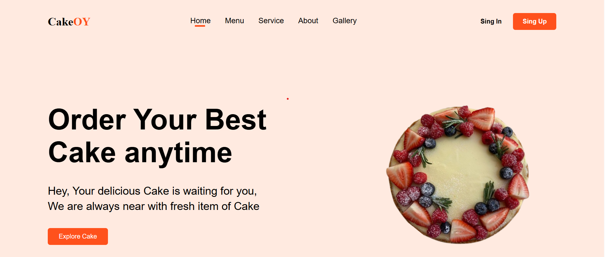
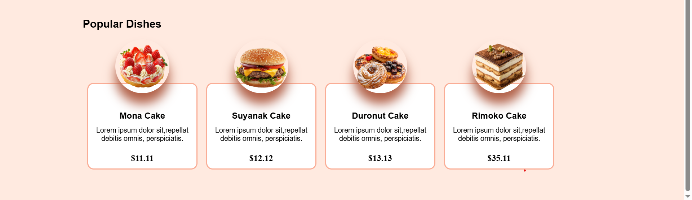
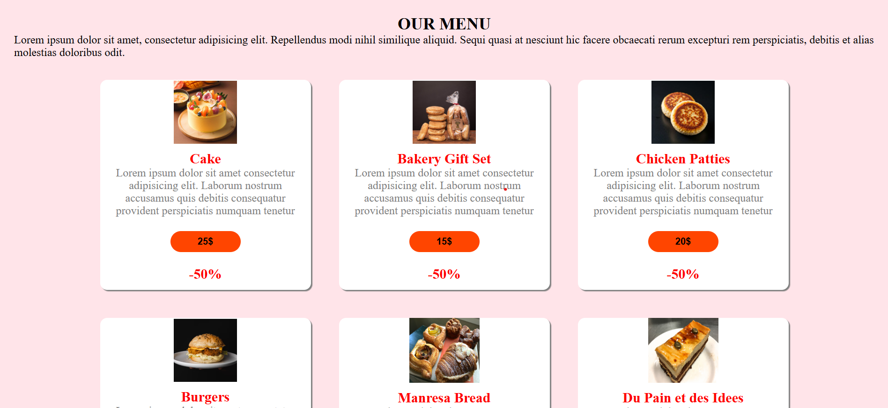
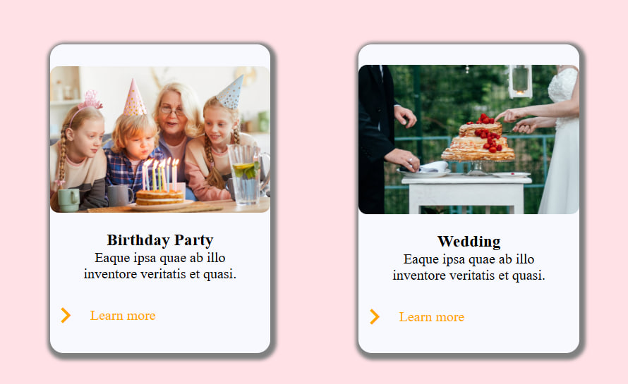
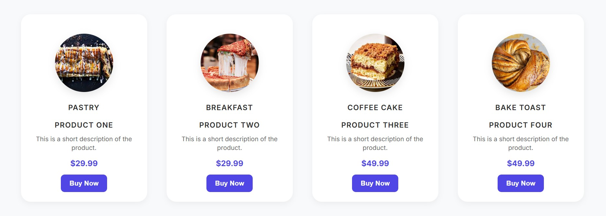
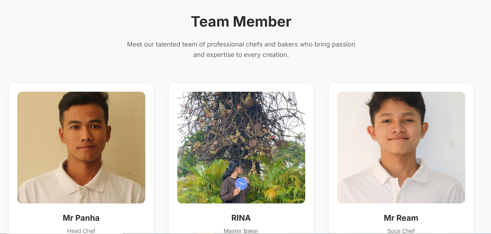
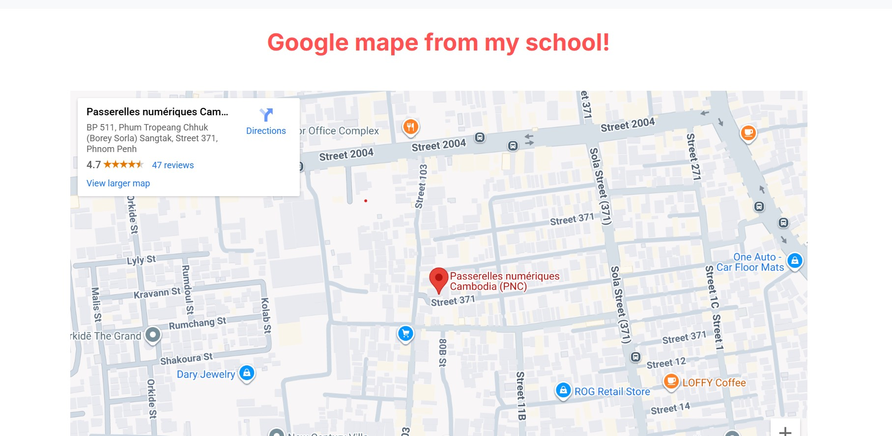
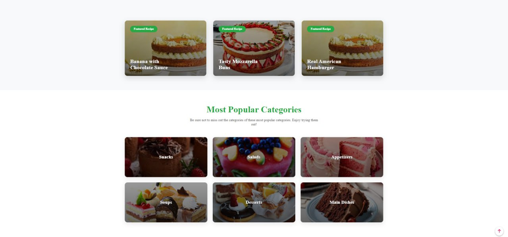
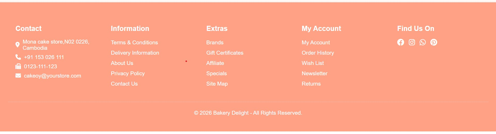

# 🏪PROJECT-BAKERY-SHOPS
We create this website for help user easy to fond the cake that they need easy to buy and know more information about the shops user and seller 

### This website has 

- 🏠Home page 
  <!-- - Nav
  - body 
  - card -->
- 🍰Menue page
  <!-- - Nav(title)
  - card Menue -->
- 💼Service page
- 💡About page 
- 🖼️Gallery page

## 🏠Home page
In home page we show about some thing that has in Our wecsite one project that has in website. In home page has nav ​​​that show all about logo Home page Menu service About Gallery and also has sing in and sing up.
#### 🏘️ In homepage has 
- Nav (logo Honme Menue sevice singin singup)
- Body (Paragrah that discribe and cak's photo)
- card (card for show some cake that most populer)

#### 🖼️sreanshort pic of webisite

## 🍰Menue page
Our website also has Menue page that give user easy to use and easy to find new cake that they want and they can know about the price can and older. They can fond new cake and fond for buy it and get more in formation bout cake and price🤑.
#### 🍩In the menue page has 
- nav(title and short discribe)
- card(show about Menue)
### 🖼️Picture screnshort of menue page

## 💼Sevice Page 
In website has Sever page also like this we can help people ot user to know about our product.
### 🌐In the service page has
- nav(title and short discribe)
- card(show about th sevice in the website)
### 🖼️sreanshort picture of sevice page

## 💡About page
In about page has alot of information about our shop that show about our team card cake
### In about page has
- title and short describe
- has card cake
- show our team 
- has gogle map pic
 ###  🖼️sreanshort picture of sevice page

## 🖼️Gallery page 
In Gallery page has alot of cake photo that so interest cake.so user can see cake more can find new cake menue🍩
### 🍰In Gallery page has 
- In Galery page has cak's photo and cake that most pupular
- Has card that show about the name of cake 
### 🖼️sreanshort of gallery page 

## 👉Footer page 
In our website also has footer page that has alot infor mation about our home page so user can see and can contect to us easy and fine lacation and also know about our service.
### 👉Footer has 
- ☎️conteact that has Adderss phone number and email
- 💡Information about our service 
- 🛠️Extras 
- 🌐Accont social media 
- 🕵️find us 
### 🖼️sreanshort of footer

<!-- ## 👥 Contributors

 -->

## Team Members 

| Name | Role | GitHub | Email |
|------|------|--------|-------|
| Panha Koeun | Frontend Developer | [@PANHA.KOEUN](https://github.com/Chhitchhanut) | panha.koeun@student.passerellesnumeriques.org |
| ream khorn | Frontend Developer | [@Ream111222333](https://github.com/HutSreypov) | ream.khorn@student.passerellesnumeriques.org |
| Rina Ho | Frontend Developer | [@Rinaho2](https://github.com/LEKSINAT) | rina.ho@student.passerellesnumeriques.org |

